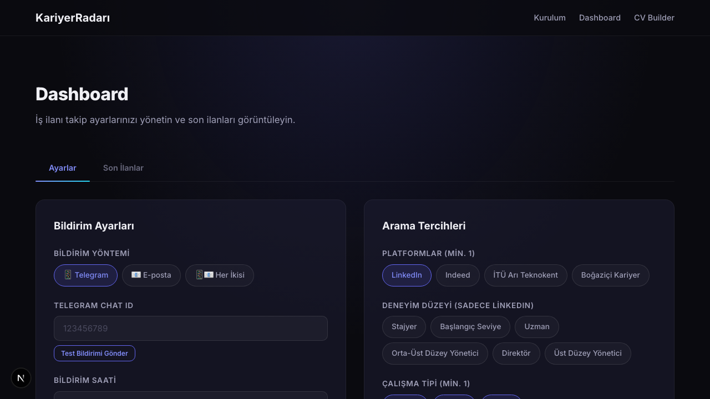
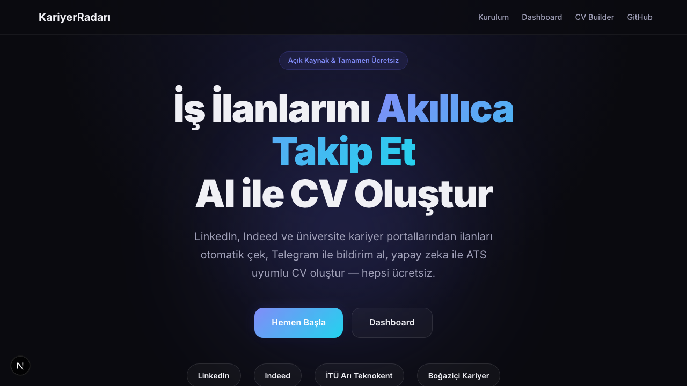

# KariyerRadarı

KariyerRadarı, belirlediğiniz anahtar kelimelere ve kriterlere göre birden fazla platformdan (LinkedIn, Indeed, İTÜ Arı Teknokent, Boğaziçi Kariyer) iş ilanlarını toplayıp, yapay zeka destekli özetlerle size Telegram veya E-posta üzerinden bildirim gönderen akıllı bir iş arama asistanıdır.

## Özellikler

- **Çoklu Platform:** LinkedIn, Indeed, İTÜ Arı Teknokent, Boğaziçi Kariyer.
- **Kesin Kelime Filtreleme:** Belirlediğiniz arama kelimeleri dışındaki ilanları almaz, alakasız işlerin bildirim olarak gelmesini engeller.
- **Üniversite İlanları:** İTÜ Arı Teknokent ve Boğaziçi Kariyer gibi sitelerde sadece **son 24 saat** içerisinde yayınlanmış, tamamen yeni ilanları çeker. Dilerseniz sadece kelimelere bağlı kalmadan tüm yeni yayınlanan üniversite ilanlarını görebilirsiniz.
- **Konum ve Uzaktan Çalışma (Remote):** Şehir bazlı arama yapabilir, Türkiye genelindeki remote ilanları ayrıca filtreleyebilirsiniz. İsterseniz **Global Remote** (Tüm Dünyadan Remote) seçeneğiyle yurtdışındaki remote fırsatlarını da yakalayabilirsiniz.
- **CV ve Kapak Mektubu Oluşturucu:** Telegram'a gelen iş ilanlarının altındaki linke tıkladığınızda, o ilanın özelliklerine ve gerekliliklerine uygun şekilde otomatik CV / Cover Letter oluşturabileceğiniz bir web sayfasına yönlendirilirsiniz.

## Kurulum Rehberi

Projeyi kendi bilgisayarınızda çalıştırmak veya kendi sunucunuzda/GitHub hesabınızda barındırmak isterseniz aşağıdaki adımları izleyebilirsiniz.

### 1. Repoyu Klonlayın
```bash
git clone https://github.com/BatuhanBilgili/KariyerRadar-.git
cd KariyerRadar-
```

### 2. Supabase Veritabanı Kurulumu
Proje veritabanı olarak **Supabase (PostgreSQL)** kullanmaktadır. Supabase üzerinde yeni bir proje oluşturun ve aşağıdaki SQL komutlarını **SQL Editor** üzerinden çalıştırarak gerekli tabloları/güncellemeleri yapın:

```sql
-- Yeni Eklenen Özellikler İçin Veritabanı Şeması Güncellemesi
ALTER TABLE users ADD COLUMN IF NOT EXISTS experience_levels TEXT[] NOT NULL DEFAULT '{}';
ALTER TABLE users ADD COLUMN IF NOT EXISTS remote_global BOOLEAN NOT NULL DEFAULT false;
```
*(Gerekli diğer tabloların da oluşturulduğundan emin olun: `users`, `job_listings`, `sent_notifications` vb.)*

### 3. Çevresel Değişkenler (.env)
Hem scraper (backend) hem de frontend için API anahtarlarına ihtiyacınız var. Kök dizinde (veya `scraper/.env`) aşağıdaki değişkenleri tanımlayın:

```env
SUPABASE_URL="https://[PROJE_ID].supabase.co"
SUPABASE_SERVICE_ROLE_KEY="senin_supabase_keyin"
TELEGRAM_BOT_TOKEN="botfather_token"
GEMINI_API_KEY="google_gemini_api_key"
RESEND_API_KEY="resend_mail_key"
RESEND_FROM_EMAIL="onboarding@resend.dev"
WEBSITE_URL="http://localhost:3000" # Canlıya alırken kendi domaininle değiştir
```

### 4. Dashboard (Frontend) Çalıştırma
Arayüze erişip ayarlarınızı (arama kelimeleri, çalışma tipi, lokasyon) yönetmek için Next.js uygulamasını başlatın:
```bash
cd frontend
npm install
npm run dev
```
Uygulama `http://localhost:3000` adresinde çalışacaktır.

*Dashboard Ayar Görünümü:*


*Dashboard İlan Listesi:*


### 5. Scraper'ı Manuel Çalıştırma
Platformlara istek atacak scraper servisini denemek veya manuel çalıştırmak için:
```bash
cd scraper
python3 -m venv venv
source venv/bin/activate
pip install -r requirements.txt
python main.py
```
> Her çalıştığında sadece **yeni (daha önce gönderilmemiş)** ilanları tespit eder ve kullanıcılara Telegram/Mail üzerinden bildirim gönderir.

### 6. GitHub Actions (Otomatik Çalıştırma)
Sistemin tamamen otonom olarak (örneğin her sabah saat 09:00'da) çalışmasını istiyorsanız, bu repoyu fork'ladıktan sonra kendi GitHub deponuzun **Settings > Secrets and variables > Actions** sayfasına gidin. 

3. adımda belirtilen tüm anahtarları (`SUPABASE_URL`, `SUPABASE_SERVICE_ROLE_KEY`, `TELEGRAM_BOT_TOKEN`, vb.) buraya **Repository secret** olarak ekleyin. Ardından repo ana sayfasında **Actions** sekmesine tıklayıp "Enable workflows" diyerek otomatik görevleri aktif hale getirebilirsiniz.
